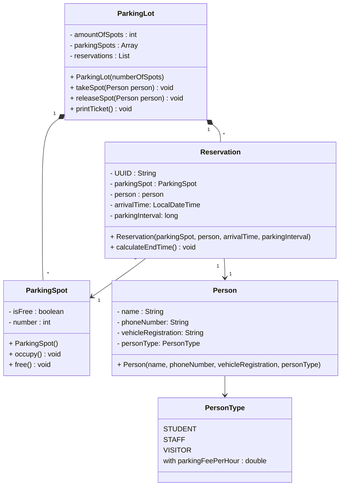

# Class diagram for Lexicon Parking App

```mermaid
classDiagram
    class ParkingLot {
        - amountOfSpots : int
        - parkingSpots : Array
        - reservations : List
        + ParkingLot(numberOfSpots)
        + takeSpot(Person person) void
        + releaseSpot(Person person) void
        + printTicket() void
    }

        
    class Reservation {
        - UUID : String
        - parkingSpot : ParkingSpot
        - person : person
        - arrivalTime: LocalDateTime
        - parkingInterval: long
        + Reservation(parkingSpot, person, arrivalTime, parkingInterval)
        + calculateEndTime() void
    }

    class ParkingSpot {
        - isFree : boolean
        - number : int
        + ParkingSpot()
        + occupy() void
        + free() void
    }

    class Person {
        - name : String
        - phoneNumber: String
        - vehicleRegistration: String
        - personType: PersonType
        + Person(name, phoneNumber, vehicleRegistration, personType)
    }
    
    class PersonType {
        STUDENT 
        STAFF
        VISITOR
        with parkingFeePerHour : double
    } 

    Reservation "1" --> "1" Person
    Reservation "1" --> "1" ParkingSpot
    ParkingLot "1" *-- "*" ParkingSpot
    ParkingLot "1" *-- "*" Reservation
    Person --> PersonType
```