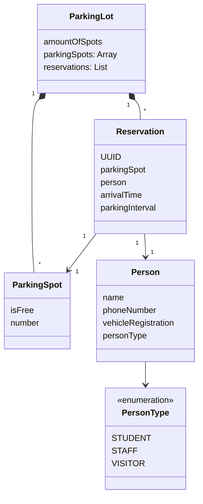

# Domain Model for Lexicon Parking App

```mermaid
classDiagram
    class ParkingLot {
        amountOfSpots
        parkingSpots: Array
        reservations: List
    }

    class Reservation {
        UUID
        parkingSpot
        person
        arrivalTime
        parkingInterval
    }

    class ParkingSpot {
        isFree
        number
    }

    class Person {
        name
        phoneNumber
        vehicleRegistration
        personType
    }
    
    class PersonType {
        <<enumeration>>
        STUDENT
        STAFF
        VISITOR
    }

    Reservation "1" --> "1" Person
    Reservation "1" --> "1" ParkingSpot
    ParkingLot "1" *-- "*" ParkingSpot
    ParkingLot "1" *-- "*" Reservation
    Person --> PersonType
```